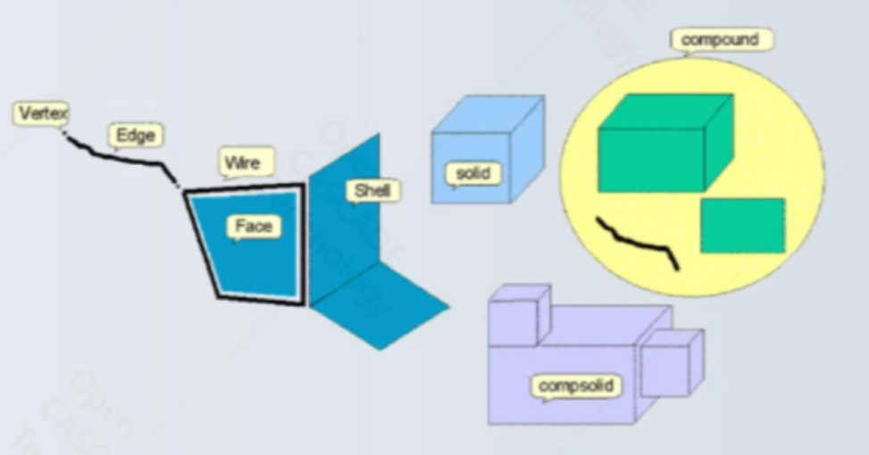
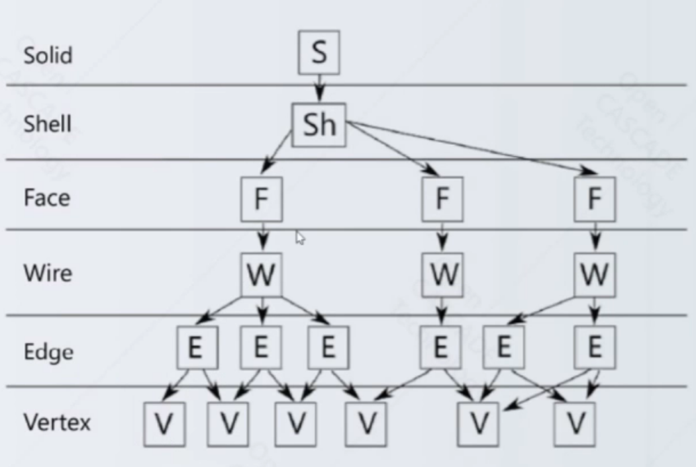

# Topological shapes

author: zrq

- Vertex: a point;
- Edge: a part of a curve limited by vertices.
- Wire: a set of edges (connected by their vertices).
- Face: a part of a surface limit4ed by wires.
- Shell: a set of faces (connected by their edges).
- Solid: a part of space limited by shells.
- Compsolid: a set of solids connected by their faces
- Compound: a group of any topological shapes.

 

## Graph structure

The following graph show an example of relations betwwen sub-shapes of a comples shape ( a solid in this case):

