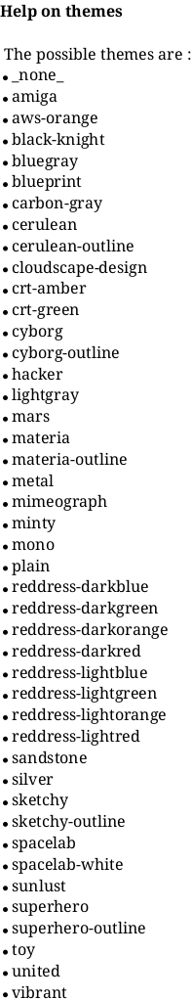
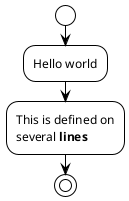

# PlantUml

作者：张荣庆

## 内置的样式表

```plantuml
@startuml
help themes
@enduml
```

使用内置样式的方法

```plantuml
@startuml
!theme plain
start
:Hello world;
:This is defined on
several **lines**;
stop
@enduml
```
