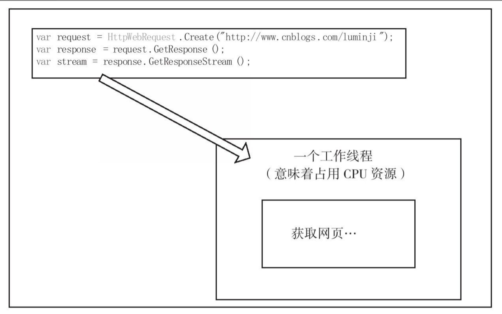

# 个人思考整理

zrq\
读 改善C#程序的157个建议 整理

[源码-luminji](https://www.cnblogs.com/luminji)  
[157-Suggestions-For-Improving-CSharp-Programs](https://github.com/zrq-github/157-Suggestions-For-Improving-CSharp-Programs)  

- [个人思考整理](#个人思考整理)
  - [语言基础篇](#语言基础篇)
    - [正确操作字符串(tip1)](#正确操作字符串tip1)
    - [区别readonly和const的使用方法(tip6)](#区别readonly和const的使用方法tip6)
    - [区别对待==和Equals(tip11)](#区别对待和equalstip11)
    - [使用dynamic来简化反射实现(tip15)](#使用dynamic来简化反射实现tip15)
    - [泛型](#泛型)
    - [委托](#委托)
      - [小心闭包中的陷阱](#小心闭包中的陷阱)
      - [委托的实例(Tip39)](#委托的实例tip39)
    - [协变(Tip43),逆变(Tip45)](#协变tip43逆变tip45)
    - [一些有趣, 可能存在争议的点](#一些有趣-可能存在争议的点)
  - [资源管理](#资源管理)
  - [序列化](#序列化)
  - [异常与自定义异常](#异常与自定义异常)
    - [避免在finally内撰写无效代码](#避免在finally内撰写无效代码)
    - [避免嵌套异常, 避免吃掉异常](#避免嵌套异常-避免吃掉异常)
    - [总是处理未捕获的异常](#总是处理未捕获的异常)
    - [正确捕获多线程中的异常(Tip66)](#正确捕获多线程中的异常tip66)
    - [个人感觉存在一定异议](#个人感觉存在一定异议)
  - [异步, 多线程, 任务和并行](#异步-多线程-任务和并行)
    - [区分异步和多线程应用场景](#区分异步和多线程应用场景)
    - [避免锁定不恰当的同步对象](#避免锁定不恰当的同步对象)
    - [线程的若干建议](#线程的若干建议)
    - [Thread <- ThreadPool <- Task](#thread---threadpool---task)
  - [待定](#待定)

## 语言基础篇

### 正确操作字符串(tip1)

- StringBuilder
- string.Format()

其实通过看IL代码, format内部处理就是调用了 StringBuilder 来进行处理.

但是, 个人还是强烈建议使用 '\$' (C#6.0以上支持)

'\$' 在这里不单单是语法糖这么简单的事情, 个人感觉是对字符串的处理有进行进一步的优化.

为什么这么说, 先看一段测试的代码:

```C#
static void Main(string[] args)
{
    DateTime dateTime = DateTime.Now;
    for (int i = 0; i < 1000000000; i++)
    {
        var a = string_newformat();
    }
    DateTime doDateTime = DateTime.Now;
    Console.WriteLine((doDateTime - dateTime).TotalSeconds);
    Console.ReadKey();
    // Console.WriteLine($"PI = {Math.PI,10:N}");
}
private static string string_format()
{
    string a = "a";
    string b = "b";
    return string.Format("{0}{1}", a, b);
}
private static string string_newformat()
{
    string a = "a";
    string b = "b";
    return $"{a}{b}";
}
```

string_format: 66.606888.\
string_newformat: 26.7890431.

我只能单论调用的消耗, 差距还是蛮大了, 特别是像我们竟然在循环里面记录一些信息, 整体下来的影响还是有一点的.

其实我们回过头, 看一下IL代码, 应该能够大致理解了:

在 string.Format 的IL代码内, 本质上还是调用的 StringBuilder 类来进行一系列操作的. 每次的 string.Format 都是对 StringBuilder 的一次创建以及销毁.

在 '\$' 的Il代码中, 继续往内部走, 能够很直接的看到是直接操作的内存.\
也许在 StringBuilder 内部也是一样的, 但是调用层级太多了, 看不明白.

### 区别readonly和const的使用方法(tip6)

const 编译常量就不多说了.

readonly变量是运行时变量，其赋值行为发生在运行时。
readonly的全部意义在于，它在运行时第一次被赋值后将不可以改变。

- 对于值类型变量，值本身不可改变（readonly，只读）
- 对于引用类型变量，引用本身（相当于指针）不可改变

readonly 可在构造器里面被多次初始化. So? 是否可以利用这个机制来做多语言支持, 或者完成不同环境下的不同的初始化.

### 区别对待==和Equals(tip11)

无论是操作符"=="还是方法"Equals"，都倾向于表达这样一个原则：

对于值类型，如果类型的值相等，就应该返回True。
对于引用类型，如果类型指向同一个对象，则返回True。

再引出操作符"==="和"Equals"方法之间的一点区别:

一般来说, 对于引用类型, 我们要定义"值相等性", 应该仅仅去重载Equals方法, 同时让"表示"引用相等性".

注意　由于操作符“==”和"Equals"方法从语法实现上来说，都可以被重载为表示“值相等性”和“引用相等性”。

所以，为了明确有一种方法肯定比较的是“引用相等性”，FCL中提供了Object.ReferenceEquals方法。该方法比较的是：两个示例是否是同一个示例.

### 使用dynamic来简化反射实现(tip15)

大概我们多多少少都了解反射会有性能消耗..

```C#
public class DynamicSample
{
    public string Name { get; set; }

    public int Add(int a, int b)
    {
        return a + b;
    }
}
```

常规反射:

```C#
DynamicSample reflectSample = new DynamicSample();
var addMethod = typeof(DynamicSample).GetMethod("Add");
Stopwatch watch1 = Stopwatch.StartNew();
for (var i = 0; i < times; i++)
{
    addMethod.Invoke(reflectSample, new object[] { 1, 2 });
}
Console.WriteLine(string.Format("反射耗时：{0} 毫秒", watch1.ElapsedMilliseconds));
```

dynamic反射:

```C#
dynamic dynamicSample = new DynamicSample();
Stopwatch watch2 = Stopwatch.StartNew();
for (int i = 0; i < times; i++)
{
    dynamicSample.Add(1, 2);
}
Console.WriteLine(string.Format("dynamic耗时：{0} 毫秒", watch2.ElapsedMilliseconds));
```

反射耗时：2575毫秒

dynamic耗时：76毫秒

这么看来差距很大

### 泛型

**总是优先考虑对泛型的使用**(tip32):

List\<T\> 是不是很好用? \
其实就目前在C#上的开发中, 已经很少见到使用以前的那种常规数组的使用方式.\
在设计一个通用的类的时候, 其他我们可以多考虑使用泛型\
泛型能够规避掉“转型为object类型”或“从object转型为实际类型”所带来的效率损耗。尤其是涉及的操作类型是值类型时，还会带来装箱和拆箱的性能损耗.

**避免在泛型类型中声明静态成员**(tip33):

```C#
static void Main(string[] args)
{
    MyList<int> list1 = new MyList<int>();
    MyList<int> list2 = new MyList<int>();
    MyList<string> list3 = new MyList<string>();
    Console.WriteLine(MyList<int>.Count);
    Console.WriteLine(MyList<string>.Count);
}
class MyList<T>
{
    public static int Count { get; set; }
    public MyList()
    {
        Count++;
    }
}
```

```C#
static void Main(string[] args)
{
    Console.WriteLine(MyList.Func<int>());
    Console.WriteLine(MyList.Func<int>());
    Console.WriteLine(MyList.Func<string>());
}

class MyList
{
    static int count;
    public static int Func<T>()
    {
        return count++;
    }
}
```

所以你们会觉得结果是什么?

因为 MyList＜int＞ MyList＜string＞ 是完全不同的类. 所以他们的静态变量并不是同一份数据.

若T所指定的数据类型是一致的，那么两个泛型对象间还是可以共享静态成员的，如上文的list1和list2。但是，为了规避因此而引起的混淆，仍旧建议在实际的编码工作中，尽量避免声明泛型类型的静态成员。

**为泛型参数设定约束**(tip34):

约束”这个词可能会引起歧义，有些人可能认为对泛型参数设定约束是限制参数的使用，实际情况正好相反。没有约束的泛型参数作用很有限，倒是“约束”让泛型参数具有了更多的行为和属性。

如果没有约束, 他就是一个普通的objeck, 如果附件了约束, 就有了其意义, 就能做更多的事情.

```C#
class Salary
{
public int BaseSalary{get;set;}
public int Bonus{get;set;}
}

class SalaryComputer
{
    public int Compare＜T＞(T t1,T t2)where T:Salary
    {
        if(t1.BaseSalary＞t2.BaseSalary){}
    }
}
```

给了他意义.

### 委托

#### 小心闭包中的陷阱

代码1:

```C#
List<Action> lists = new List<Action>();
for (int i = 0; i < 5; i++)
{
    Action t = () =>
    {
        Console.WriteLine(i.ToString());
    };
    lists.Add(t);
}
foreach (Action t in lists)
{
    t();
}
```

代码2:

```C#
static void Main(string[] args)
{
    List<Action> lists = new List<Action>();
    for (int i = 0; i < 5; i++)
    {
        int temp = i;
        Action t = () =>
        {
            Console.WriteLine(temp.ToString());
        };
        lists.Add(t);
    }
    foreach (Action t in lists)
    {
        t();
    }
}
```

大家猜一下他们的输出是什么?

首先, 对于匿名表达式, 我们先明确一个概念, 匿名表达式会被编译成类.

如果匿名方法（Lambda表达式）引用了某个局部变量，编译器就会自动将该引用提升到该闭包对象中，即将for循环中的变量i修改成了引用闭包对象的公共变量i。这样一来，即使代码执行后离开了原局部变量i的作用域（如for循环），包含该闭包对象的作用域也还存在。理解了这一点，就能理解代码的输出了。

问题?:
多个匿名表达式, 是否会创建多个类呢?

以上的IL代码, 类式于以下的代码:

```C 闭包被编译后的类
// 被编译的匿名表达式
Action t = () =>
{
    Console.WriteLine(temp.ToString());
};
lists.Add(t);
// 等价于
class TempClass
{
    public int i;
    public void TempFuc()
    {
        Console.WriteLine(i.ToString());
    }
}
```

代码1 等价的代码:

```C#
static void Main(string[] args)
{
    List<Action> lists = new List<Action>();
    TempClass tempClass = new TempClass();
    for (tempClass.i = 0; tempClass.i < 5; tempClass.i++)
    {
        Action t = tempClass.TempFuc;
        lists.Add(t);
    }
    foreach (Action t in lists)
    {
        t();
    }
}
class TempClass
{
    public int i;
    public void TempFuc()
    {
        Console.WriteLine(i.ToString());
    }
}
```

可以看看IL代码, 基本上是一致的.

代码2 等价的代码:

```C#
static void Main(string[] args)
{
    List<Action> lists = new List<Action>();
    for (int i = 0; i < 5; i++)
    {
        TempClass tempClass = new TempClass();
        tempClass.i = i;
        Action t = tempClass.TempFuc;
        lists.Add(t);
    }
    foreach (Action t in lists)
    {
        t();
    }
}
class TempClass
{
    public int i;
    public void TempFuc()
    {
        Console.WriteLine(i.ToString());
    }
}
```

以此作为衍生, 我又想到另外一个问题?\
对于每个匿名函数来说, 是不是每个匿名函数都会被编译成一个类?\

先来看第一种:

```C#
public static int Index = 0;
static void Main(string[] args)
{
    List<Action> lists = new List<Action>();
    for (int i = 0; i < 5; i++)
    {
        Action t = () =>
        {
            Console.WriteLine(i.ToString());
        };
        lists.Add(t);

        Action b = () =>
        {
            Console.WriteLine(i.ToString());
            Console.WriteLine(Program.Index.ToString());
        };
        lists.Add(b);
    }
    foreach (Action t in lists)
    {
        t();
    }
    Console.ReadKey();
}
```

可喜可贺, 可喜可贺, 也是只有一个类, 类中有两个方法.

但是:

```C#
public static int Index = 0;
static void Main(string[] args)
{
    List<Action> lists = new List<Action>();
    for (int i = 0; i < 5; i++)
    {
        int temp = i;
        Action t = () =>
        {
            Console.WriteLine(temp.ToString());
        };
        lists.Add(t);

        Action b = () =>
        {
            Console.WriteLine(i.ToString());
            Console.WriteLine(Program.Index.ToString());
        };
        lists.Add(b);
    }
    foreach (Action t in lists)
    {
        t();
    }
    Console.ReadKey();
}
```

这种情况下, 是被编译成了两个类. 真有意思.

SO? 不同样式的匿名, 还是会被编译成不同的类去使用? 我目前还不清楚, 也不展示细讲了..

其实, 通过 Equals 也能比较一二:\
 对于代码1 使用 Equals 比较是 true, \
 对于代码2 使用 Equals 比较是 false,\
 但是稍微有点奇怪的是, 用 ReferenceEquals 比较其代码1 会被判断不一样, 因为比较的函数地址?

#### 委托的实例(Tip39)

1. 委托是方法的指针
2. 委托是一个类, 当对其进行实例化的时候，要将引用方法作为它的构造方法的参数。

为什么这么说, 看IL的代码

**关于Event**(Tip40):

其实我一直没有太理解 event 这个关键字的含义. 以前只是单纯的任务多一个 += 的关系.

event关键字为委托施加保护, 因为单纯的委托, 我们是可以在外部对齐进行置null, 即调用者如果对委托置空, 如果执行者没有进行判断, 会直接抛出异常. 按照道理来说, 这种是有问题的.

比如对于一个文件上传类 FileUploader ,什么时候通知调用者, 应该是FileUploader类自己的职责，而不是由调用者本身来决定.

**标准的事件模型**(Tip40): 这个不详细说, 但是建议去看看.

### 协变(Tip43),逆变(Tip45)

- 协变（covariant），如果它保持了子类型序关系≦。该序关系是：子类型≦基类型。
- 逆变（contravariant），如果它逆转了子类型序关系。
- 不变（invariant），如果上述两种均不适用。

让返回值类型返回比声明的类型派生程度更大的类型，就是“协变”.

在以前, 我其他不太理解, 为什么这样无法通过编译, 每次想把子类的List, 转成父类的List, 都需要去使用Linq表达式去转一下, 像便秘一样.

```C#
class Employee
{
    public string Name { get; set; }
}
class Programmer : Employee
{
}
class Manager : Employee
{
}

internal class Program
{
    static void Main(string[] args)
    {
        List<Programmer> programmers = new List<Programmer>();
        List<Employee> employees = programmers; // 编译失败

        IEnumerable<Programmer> programmers = new List<Programmer>();
        IEnumerable<Employee> employees = programmers;  // 编译成功
    }
}
```

为什么能编译成功, 得益于 out 这个关键字, 以前只是把这个作为参数的时候的返回值, 这里还有一个作用, **协变**.

```C#
List<T>
IEnumerable<out T>
```

实际上，FCL 4.0中的一些委托声明已经用out关键字来让委托支持协变了，如我们常常会使用到的：

```C#
public delegate TResult Func＜out TResult＞()
public delegate TOutput Converter＜in TInput,out TOutput＞(TInput input)
```

个人觉得一个比较直观的比较:

协变：能够使用比原始指定的派生类型的派生程度更大（更具体）的类型。例如 IFoo<父类> = IFoo<子类>\
逆变：能够使用比原始指定的派生类型的派生程度更新（更抽象）的类型。例如 IBar<子类> = IBar<父类>

**书中的几个建议**:

- 在我们自己的代码中，如果要编写泛型接口，除非确定该接口中的泛型参数不涉及变体，否则都建议加上out关键字。协变增大了接口的使用范围，而且几乎不会带来什么副作用。
- 除非考虑到该委托声明肯定不会用于可变性，否则，为委托中的泛型参数指定out关键字将会拓展该委托的应用，建议在实际的编码工作中永远这样使用.

### 一些有趣, 可能存在争议的点

- 将0值作为枚举的默认值(tip7) 避免给枚举类型的元素提供显式的值(tip8)

## 资源管理

对于资源管理, 基本上都知道使用 IDisposable

也知道两个概念:

**托管资源:** 由CLR管理分配和释放的资源，即从CLR里new出来的对象\
**非托管资源:**　不受CLR管理的对象，如Windows内核对象，或者文件、数据库连接、套接字、COM对象等\

如果我们的类型使用到了非托管资源，或者需要显式地释放托管资源，那么就需要让类型继承接口IDisposable，这毫无例外。这相当于告诉调用者：类型对象是需要显式释放资源的，你需要调用类型的Dispose方法.

先说说个人对于 IDisposable 的看法:

其实就目前来说, 我很少显示使用 IDisposable, 一是自认为我自己管理回收, 不会它他自己更好, 二是目前暂时没有直接使用非托管代码的经验.

怎么说:

```C#
internal class Program
{
    static void Main(string[] args)
    {
        SampleClass sampleClass = new SampleClass();
        SampleClass goOne = sampleClass;
        SampleClass goTwo = sampleClass;
        goOne.Dispose();
        var index = goTwo.SampleClassB.Index;
        Console.ReadKey();
    }
}
public class SampleClass : IDisposable
{
    public SampleClassB SampleClassB { get; set; }
    public SampleClass()
    {
        SampleClassB = new SampleClassB();
    }
    public void Dispose()
    {
        SampleClassB = null;
    }
}
public class SampleClassB
{
    public int Index { get; set; } = 0;
    public SampleClassB() { }
}
```

这个流程会抛异常. 如果你显示添加了 Dispose ,你永远也无法知道调用者, 合适去调用回收, 而且抛出来的空引用异常很让人迷惑. 就会吐槽, 卧槽, 我对象去哪了, 怎么为 null 了.

文中直接建议一种C#中显示释放资源的 标准的 Dispose 模式 , 直接看代码. [Tip46]

**即使提供了显式释放方法，也应该在终结器中提供隐式清理**(Tip47):

```C#
/// <summary>
/// 必须，防止程序员忘记了显式调用Dispose方法
/// </summary>
~SampleClass()
{
    //必须为false
    Dispose(false);
}
```

我记得这玩意在C++是叫析构函数?

以下建议全文背诵:

这个方法叫做类型的终结器。提供终结器的意义在于：我们不能奢望类型的调用者肯定会主动调用Dispose方法，基于终结器会被垃圾回收器调用这个特点，它被用作资源释放的补救措施。

在这里有必要对“终结器会被垃圾回收器调用”进行进一步的阐述。我们知道，在.NET中每次使用new操作符创建对象时，CLR都会为该对象在堆上分配内存，一旦这些对象不再被引用，就会回收它们的内存。对于没有继承IDisposable接口的类型对象，垃圾回收器则会直接释放对象所占用的内存；而对于实现了Dispose模式的类型，在每次创建对象的时候，CLR都会将该对象的一个指针放到终结列表中，垃圾回收器在回收该对象的内存前，会首先将终结列表中的指针放到一个freachable队列中。同时，CLR还会分配专门的线程读取freachable队列，并调用对象的终结器，只有到这个时候，对象才会真正被标识为垃圾，并且在下一次进行垃圾回收时释放对象占用的内存。

可以看到，实现了Dispose模式的类型对象，起码要经过两次垃圾回收才能真正地被回收掉，因为垃圾回收机制会首先安排CLR调用终结器。基于这个特点，如果我们的类型提供了显式释放的方法来减少一次垃圾回收，同时也可以在终结器中提供隐式清理，以避免调用者忘记调用该方法而带来的资源泄漏.

在标准的Dispose模式下:

- Dispose方法应允许被多次调用
- 在Dispose模式中应提取一个受保护的虚方法\
解决继承问题
- 在Dispose模式中应区别对待托管资源和非托管资源

其实如果我们使用了非托管资源, 还是需要记得及时释放资源, 例如文件读取这样, 如果不去主动释放掉, 该文件会被一直占用, 例如 rvt 升级的时候.

**必要时应将不再使用的对象引用赋值为null**(Tip53):

zrq-吐槽: 不是叫你没事就把普通对象给置为null, 主要是说明是给类型中的静态变量置空.

之所以静态字段不被释放（同时赋值为null语句也不会像局部变量那样被运行时编译器优化），是因为类型的静态字段一旦被创建，该“根”就一直存在。所以，垃圾回收器始终不会认为它是一个垃圾。非静态字段则不存在这个问题。

## 序列化

为无用字段标注不可序列化:

- 节省空间
- 反序列化后字段信息已经没有意义了
- 字段因为业务上的原因不允许被序列化
- 如果字段本身所对应的类型在代码中未被设定为可序列化，那它就该被标注不可序列化，否则运行时会抛出异常SerializationException

另外, 文中提到了事件的序列化, 还是第一次知道.

利用定制特性减少可序列化的字段.

使用继承ISerializable接口更灵活地控制序列化过程

实现ISerializable的子类型应负责父类的序列化

## 异常与自定义异常

zrq-暴言: CLR异常机制, 是我相当喜欢的一个机制.

自从.NET出现后，关于CLR异常机制的讨论就几乎从未停止过。迄今为止，CLR异常机制让人关注最多的一点就是“效率”问题。其实，这里存在认识上的误区，因为正常控制流程下的代码运行并不会出现问题，只有引发异常时才会带来效率问题。基于这一点，很多开发者已经达成共识：不应将异常机制用于正常控制流中。达成的另一个共识是：CLR异常机制带来的“效率”问题不足以“抵消”它带来的巨大收益。CLR异常机制至少有以下几个优点：

- 正常控制流会被立即中止，无效值或状态不会在系统中继续传播。
- 提供了统一处理错误的方法。
- 提供了在构造函数、操作符重载及属性中报告异常的便利机制。
- 提供了异常堆栈，便于开发者定位异常发生的位置。

zrq: 我们来实际测试一下, 它里面的理论 "只有引发异常时才会带来效率问题"

```C#
static void Main(string[] args)
{
    DateTime dateTime = DateTime.Now;
    var str = NoException();
    DateTime doDateTime = DateTime.Now;
    Console.WriteLine((doDateTime - dateTime).TotalSeconds);
    Console.ReadKey();
}
public static double NoException()
{
    int index = 0;
    for (int i = 0; i < 1000000000; i++)
        index++;
    return index;
}
public static double DoException()
{
    int index = 0;
    for (int i = 0; i < 1000000000; i++)
    {
        try
        {
            index++;
        }
        catch
        {

        }
    }
    return index;
}
```

NoException: 0.940719\
DoException: 0.9472912

我只能说基本持平.

**正常控制流会被立即中止，无效值或状态不会在系统中继续传播**(Tip58):

用抛出异常代替返回错误代码\
这也是我个人很喜欢使用异常的原因, 因为对于大部分情况来说, 数据初始化错误是直接中止, 这个时候我就喜欢直接抛异常出来.

**不要在不恰当的场合下引发异常**:

尤其是类库开发人员，要掌握的两条首要原则是：

正常的业务流程不应使用异常来处理。\
不要总是尝试去捕获异常或引发异常，而应该允许异常向调用堆栈往上传播.

- 如果运行代码后会造成内存泄漏、资源不可用，或者应用程序状态不可恢复，则引发异常。\
所谓**可控**，可定义为：发生异常后，系统资源仍可用，或资源状态可恢复。
- 在捕获异常的时候，如果需要包装一些更有用的信息，则引发异常。

zrq-怎么理解?:

像我们调用别人的API的时候(无法预料), 出现了异常, 我们有办法用另外的方式去还原的时候, 就可以拦截掉异常, 否则应该继续向上传递.

**提供了统一处理错误的方法**:

这是一条很好理解的建议，当捕获了某个异常，将其包装或重新引发异常的时候，如果其中包含了Inner Exception，则有助于程序员分析内部信息，方便代码调试。

**包装异常**: Inner Exception. 内部展示, 对外使用. 代码展示 Tip60

### 避免在finally内撰写无效代码

在阐述本建议之前，需要先提出一个问题：是否存在一种打破try-finally执行顺序的情况。答案是：不存在（除非应用程序本身因为某些很少出现的特殊情况在try块中退出，本建议最后会给出一个这样的例子）。你应该始终认为finally内的代码会在方法return之前执行，哪怕return是在try块中。

```C#
// 代码1
int i;
try
{
    i = 1;
}
finally
{
    i = 2;
    Console.WriteLine("\t将int结果改为2，finally执行完毕");
}
return i;

// 代码2
int i;
try
{
    return i = 1;
}
finally
{
    i = 2;
    Console.WriteLine("\t将int结果改为2，finally执行完毕");
}
```

猜猜他们的返回值?

直接分析IL代码 Tip61

```C#
// 代码3
static User TestUserReturnInTry()
{
    User user = new User() { Name = "Mike", BirthDay = new DateTime(2010, 1, 1) };
    try
    {
        return user;
    }
    finally
    {
        user.Name = "Rose";
        user.BirthDay = new DateTime(2010, 2, 2);
        Console.WriteLine("\t将user.Name改为Rose");
    }
}
// 代码4
private static User TestUserReturnInTry2()
{
    User user = new User() { Name = "Mike", BirthDay = new DateTime(2010, 1, 1) };
    try
    {
        return user;
    }
    finally
    {
        user.Name = "Rose";
        user.BirthDay = new DateTime(2010, 2, 2);
        user = null;
        Console.WriteLine("\t将user置为anull");
    }
}
```

这个又如何?
直接解释IL代码.

### 避免嵌套异常, 避免吃掉异常

```C#
// 抛出异常的方式一
catch
{
throw;
}

// 抛出异常的方式二
catch(Exception err)
{
// 工作代码
throw err;
}
```

抛出异常二, 会吃掉异常, 即重置堆栈信息.

### 总是处理未捕获的异常

举例本次开发的  jd-v10.4 在全程开发的时候, 基本没有主动加上try catch. 因为在开发途中, 我需要很明确哪些会引发异常, 那里就去捕获异常, 很有可能会隐藏问题所在. 所以当时就想有没有一种机制, 能够让我就算不去写try, 也能捕获到异常, 并且不会去闪退.

就 framework 而言, 目前大致有两种方式.

```C#
// 应用级的捕获
static void Main(string[] args)
{
    AppDomain.CurrentDomain.UnhandledException += new UnhandledExceptionEventHandler(CurrentDomain_UnhandledException);
}

// UI级别的捕获
public App()
{
    this.Dispatcher.UnhandledException += new DispatcherUnhandledExceptionEventHandler(Application_DispatcherUnhandledException);
    AppDomain.CurrentDomain.UnhandledException += new UnhandledExceptionEventHandler(CurrentDomain_UnhandledException);
}
// 不结束应用
//e.Handled = true;
```

AppDomain.CurrentDomain.UnhandledException:

UnhandledException提供的机制并不能阻止应用程序终止，也就是说，执行CurrentDomain_UnhandledException方法后，应用程序就会被终止。

这里补一个[官方说明](https://docs.microsoft.com/zh-cn/dotnet/api/system.appdomain.unhandledexception?view=net-6.0), 我暂时不是很明白, 也没有实际测试, 目前接触的代码的应用程序域都是一个:

假设线程在应用程序域“AD1”中启动，在应用程序域“AD2”中调用方法，并从中调用应用程序域“AD3”中的方法，其中引发异常。 可以引发事件的第一个应用程序域 UnhandledException 是“AD1”。 如果该应用程序域不是默认应用程序域，则还可以在默认应用程序域中引发该事件。

从 .NET Framework 4 开始，对于损坏进程状态（如堆栈溢出或访问冲突）的异常，不会引发此事件，除非事件处理程序是安全关键且具有HandleProcessCorruptedStateExceptionsAttribute属性。

this.Dispatcher.UnhandledException:

WPF窗体程序的异常捕获, 如果我们是在UI线程中, 抛出了异常, 会被这个事件进行捕获. 我们可以拦截掉这个异常, 由我们判断需不需要由我们关闭应用. 这个东西在新模块尝试使用了, 挺好用的, 对于开发过程中.

测试过的一些小问题:

这个UI级别的不是单纯只捕获这一个UI, 二是整个UI线程的异常, 如果我们使用的话, 记得在关闭窗口的去回收掉, 不然异常信息可能会很多.

### 正确捕获多线程中的异常(Tip66)

文中所提到的几个知识点:

- 从.NET 2.0开始，任何线程上未处理的异常，都会导致应用程序的退出（先会触发AppDomain的UnhandledException)
- 也就是说, 为了不至于崩溃, 新起的线程中异常的捕获, 需要将线程中的代码 try 起来
- 不过, 我也仍然也需要将线程内部的异常传递到主线程中上.

那么我们如何将异常信息, 带到主线程中.

对于WPF:

```C#
Thread t = new Thread((ThreadStart)delegate
{
    try
    {
        throw new Exception("非窗体线程异常");
    }
    catch (Exception ex)
    {
        this.Dispatcher.Invoke((Action)delegate
        {
            throw ex;
        });
    }
});
t.Start();
```

一个标准的线程异常处理传递模型(一般建议用Task进行调度)(Tip85):

```C#
// 通过事件来包装异常 - 最推荐的做法
static event EventHandler<AggregateExceptionArgs> AggregateExceptionCatched;
public class AggregateExceptionArgs : EventArgs
{
    public AggregateException AggregateException { get; set; }
}
static void Main(string[] args)
{
    AggregateExceptionCatched += new EventHandler<AggregateExceptionArgs>(Program_AggregateExceptionCatched);
    Task t = new Task(() =>
    {
        try
        {
            throw new InvalidOperationException("任务并行编码中产生的未知异常");
        }
        catch (Exception err)
        {
            AggregateExceptionArgs errArgs = new AggregateExceptionArgs() { AggregateException = new AggregateException(err) };
            AggregateExceptionCatched(null, errArgs);
        }
    });
    t.Start();

    Console.WriteLine("主线程马上结束");
    Console.ReadKey();
}
static void Program_AggregateExceptionCatched(object sender, AggregateExceptionArgs e)
{
    foreach (var item in e.AggregateException.InnerExceptions)
    {
        Console.WriteLine("异常类型：{0}{1}来自于：{2}{3}异常内容：{4}", item.GetType(), Environment.NewLine, item.Source, Environment.NewLine, item.Message);
    }
}
```

zrq-总述:

当然, 说了这么多异常处理机制的好处, 又没有什么性能问题, 异常也不是乱用的.

其他就目前我接受的代码来说, 一些代码是真喜欢用 try catch, 关键还是喜欢用 catch (Exception ex) 来进行包裹, 好用归好用, 你们就不闲BUG很难查, 定位嘛..

就我自己目前开发的来说, 除非涉及到, 抛出异常后, 需要继续执行的, 全部异常向上传递.\
抛出异常后, 如果是CLR异常, 全部向上传递, 如果是Revit异常的, 根据流程进行处理.\

So, 其实在这里建议呢, 如果是要捕获RevitAPI的异常, 建议捕获:

```C#
// 内部异常
Autodesk.Revit.Exceptions.InternalException
// RevitAPI的顶层异常
Autodesk.Revit.Exceptions.ApplicationException
```

Autodesk.Revit.Exceptions.InternalException:

这个异常, 就是我们经常交给RevitAPI运算, 但是它内部计算错误, 抛出来的异常, 这个异常一般来说我们基本救不回来, 直接跳过, 也没必要记录了日志. 其他的异常我们都有一定的机会能够救回来.

另外就是一些小吐槽:

就是封装一些公共库的时候, 不要带上业务逻辑,

举个例子, 当然是个人开发和习惯的理解:

当时看到这个API的时候, 第一反应 MEPCurveCommon.GetMepHeight() 只是那高. 但是进去一看, 好家伙还拿了半径, 好家伙, 还是通过 try catch 拿的(其他通过连接点判断一下就好了), 如果大量的半径管道通过这个去拿, 不慢死你, 所以有时候如果你觉得自己的代码性能没问题的话, 不妨想想你调用的别人写的函数是不是有"亿"丢丢问题.\
还有就是针对这个函数返回 0.0 我是觉得很奇怪的, 很强的针对性, double有 double.NaN 来表示无效性, 或者直接抛异常, 告诉调用者, 你被TM瞎搞了, 滚回去自己去校验你传进来的数据.

其他还有一些, 类库这东西, 该抛异常还是抛出来, 不要全部吃掉了, 传过来一个意义不明的返回值.

### 个人感觉存在一定异议

- 为循环增加Tester-Doer模式而不是将try-catch置于循环内\
现实性, 再调用其他人的类库的时候, 抛出异常, 程序要继续执行, 就会在for循环内写try.
- 避免在调用栈较低的位置记录异常(Tip70).\
其他感觉就像是, 不要导出去记录日志.

## 异步, 多线程, 任务和并行

### 区分异步和多线程应用场景

先说结论:

- 计算密集型工作，采用多线程。
- IO密集型工作，采用异步机制。

为什么这么说?

计算密集型工作, 必须占用CPU进行计算, 所以需要多线程.
IO密集型工作, 不用占用CPU资源, 所以异步.

“IO操作的DMA（Direct Memory Access）模式”。\
DMA即直接内存访问，是一种不经过CPU而直接进行内存数据存储的数据交换模式。通过DMA的数据交换几乎可以不损耗CPU的资源。在硬件中，硬盘、网卡、声卡、显卡等都有DMA功能。CLR所提供的异步编程模型就是让我们充分利用硬件的DMA功能来释放CPU的压力。

还有前不久的, N卡 A卡 的GPU绕过CPU直接读写磁盘的模式.

如果我们想要捕获一个网页, 如果该网页的内容很多，或者当前的网络状况不太好，获取网页的过程会持续较长时间。于是，我们可能会想到用新起工作线程的方法来完成这项工作，这样在等待网页内容返回的过程中界面就不会阻止了.

所以在一般情况下, 我们会很容易这么写:

```C#
Thread t = new Thread(() =>
{
    var request = HttpWebRequest.Create("http://www.cnblogs.com/luminji");
    var response = request.GetResponse();
    var stream = response.GetResponseStream();
    using (StreamReader reader = new StreamReader(stream))
    {
        var content = reader.ReadLine();
        this.Dispatcher.BeginInvoke(() =>
        {
            this.textBoxPage.Text = $"线程调用{content}";
        });
    }
});
t.Start();
```

这样没有问题, 但是他高效嘛?\
再来两张图.




如果我们用的上面那种方式, 很明显在读取网页的整个过程中, 该工作线程始终被阻碍, 直到获取网页完毕. 在整个过程中，工作线程被占用着，这意味着系统的资源始终被消耗着、等待着.

如我去使用异步:

```C#
private void button_Copy_Click(object sender, RoutedEventArgs e)
{
    var request = HttpWebRequest.Create("http://www.sina.com.cn");
    request.BeginGetResponse(this.AsyncCallbackImpl, request);
}
public void AsyncCallbackImpl(IAsyncResult ar)
{
    WebRequest request = ar.AsyncState as WebRequest;
    var response = request.EndGetResponse(ar);
    var stream = response.GetResponseStream();
    using (StreamReader reader = new StreamReader(stream))
    {
        var content = reader.ReadLine();
        this.textBoxPage.Dispatcher.BeginInvoke(() =>
        {
            this.textBoxPage.Text = content;
        });
    }
}
```

zrq: 这是线程中的异步

新起异步操作后，CLR会将工作丢给线程池中的某个工作线程来完成。当开始I/O操作的时候，异步会将工作线程还给线程池，这时候就相当于获取网页的这个工作不会再占用任何CPU资源了。直到异步完成，即获取网页完毕，异步才会通过回调的方式通知线程池，让CLR响应异步完毕。可见，异步模式借助于线程池，极大地节约了CPU的资源.

### 避免锁定不恰当的同步对象

- 同步对象在需要同步的多个线程中是可见的同一对象\
简单来说, 锁定的对象对双方来说是可见的.
- 在非静态方式中, 静态变量不应作为同步对象\
文中提到一个原则: 在编写多线程代码时, 类型的静态方法应当保证线程安全,非静态方案不需实现线程安全.\
理由是: 如果引用程序中有多个实例, 在遇到这个锁的时候,他们都会产生同步.
- 值类型对象不能作为同步对象\
简单来说就是锁不住.
- 避免将字符串作为同步对象 **\
锁定字符串是完全没有必要的，而且相当危险。这整个过程看上去和值类型正好相反。字符串在CLR中会被暂存到内存里，如果有两个变量被分配了相同内容的字符串，那么这两个引用会被指向同一块内存。所以，如果有两个地方同时使用了lock("abc")，那么它们实际锁定的是同一个对象，这会导致整个应用程序被阻滞
- 降低同步对象的可见性\
如果锁定的对象是 typeof(SampleClass) typeof 返回的对象是一致的, SampleClass的所有实例所共有的, 如果这样所有的 SampleClass 实例将会全部被同步.

### 线程的若干建议

- 建议74: 警惕线程的IsBackground\
在CLR框架中, 线程分为前台线程和后台线程.\
如果前台线程不退出，应用程序的进程就会一直存在\
在实际编码中应该更多地使用后台线程。只有在非常关键的工作中，如线程正在执行事务或占有的某些非托管资源需要释放时，才使用前台线程。

- 建议75: 静态线程不会立即启动

- 建议76: 警惕线程优先级

- 建议77: 正确停止线程\
介绍合理停止线程的方式, 正如线程不能立即启动一样, 线程也不能马上停止.\
协作式取消（Cooperative Cancellation）

- 建议78: 应该避免线程数量太多
错误地创建过多线程的一个典型的例子是：为每一个Socket连接建立一个线程去管理。\
建议用异步, 参考建议71.

其他这里可以解释一下, 为什么有时候, 明明界面都关闭了, 但是进程没有退出.

### Thread <- ThreadPool <- Task

ThreadPool相对于Thread来说具有很多优势，但是ThreadPool在使用上却存在一定的不方便。比如：

❑ThreadPool不支持线程的取消、完成、失败通知等交互性操作。
❑ThreadPool不支持线程执行的先后次序。(很重要-外部事件).

在这里不详细介绍 Task 的用法, 可以自己看看 建议80

附上一段代码, 体会一下:

```C#
static void Main(string[] args)
{
    CancellationTokenSource cts = new CancellationTokenSource();
    Task<int> t = new Task<int>(() => AddCancleByThrow(cts.Token), cts.Token);
    t.Start();
    t.ContinueWith(TaskEndedByCatch);
    //等待按下任意一个键取消任务
    Console.ReadKey();
    cts.Cancel();
    Console.ReadKey();
}
static void TaskEndedByCatch(Task<int> task)
{
    Console.WriteLine("任务完成，完成时候的状态为：");
    Console.WriteLine("IsCanceled={0}\tIsCompleted={1}\tIsFaulted={2}", task.IsCanceled, task.IsCompleted, task.IsFaulted);
    try
    {
        Console.WriteLine("任务的返回值为：{0}", task.Result);
    }
    catch (AggregateException e)
    {
        e.Handle((err) => err is OperationCanceledException);
    }
}
static int AddCancleByThrow(CancellationToken ct)
{
    Console.WriteLine("任务开始……");
    int result = 0;
    while (true)
    {
        ct.ThrowIfCancellationRequested();
        result++;
        Thread.Sleep(1000);
    }
    return result;
}
```

其他:
区分WPF和WinForm的线程模型

## 待定

**异步不是多线程, 普通的异步调用也不会开启线程**:

举例一个现实生活中的例子:

比做家务, 需要完成 烧水 洗衣服 拖地 这几件事情. 然后就只有你一个人(CPU资源). 这些事情我们都需要一件一件的去做, 但是呢. 比如说烧水, 我把水放在炉子上烧开的时候, 是不是就可以去洗衣服(把洗衣放进洗衣机), 然后去拖地, 这三件事情看起来是不是一起在执行的, 但是只有你一个人. 这叫 **异步**.

如果把一个人做这几件事情, 变成三个人去做三件事. 这就叫 **多线程**.

我们应该多多少少听过一些软件或者游戏, 在不同的CPU的执行效率不一样, 其实就跟软件优化用的是单核还是多核, 单核的性能是由上限的, 你看着你的CPU占用不高, 但就是软件卡.

我们开发人员口中常说的同步、异步，其实是对方法执行的描述。因为编程语言本身是没有线程的，它只能去向操作系统申请线程，去执行代码。
同步方法，代码执行第一行到最后一行依次执行到结束，完成第一行之后进入下第二行直到最后一行，这就是同步，阻塞式的。
异步方法，不会等待当前行执行完成，就会进行下一行执行代码，非阻塞式的.
