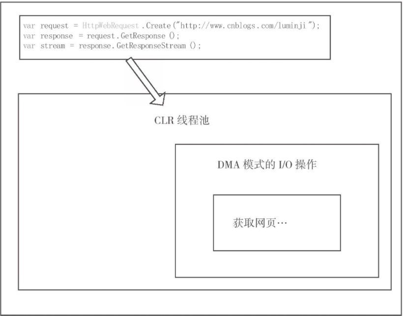

# 个人思考整理

zrq\
读 改善C#程序的157个建议 整理

## 语言基础篇

### 正确操作字符串

- 使用StringBuilder\
拼接
- string.Format()\
这里其实建议是还是用 '$' 这个是等价于前者的语法糖, 代码更加直观.

### 区别readonly和const的使用方法

const 编译常量就不多说了.

readonly变量是运行时变量，其赋值行为发生在运行时。readonly的全部意义在于，它在运行时第一次被赋值后将不可以改变。

- 对于值类型变量，值本身不可改变（readonly，只读）
- 对于引用类型变量，引用本身（相当于指针）不可改变

readonly 可在构造器里面被多次初始化

### 区别对待==和Equals

无论是操作符“==”还是方法"Equals"，都倾向于表达这样一个原则：

对于值类型，如果类型的值相等，就应该返回True。
对于引用类型，如果类型指向同一个对象，则返回True。

再引出操作符“==”和"Equals"方法之间的一点区别:\
一般来说，对于引用类型，我们要定义“值相等性”，应该仅仅去重载Equals方法，同时让“==”表示“引用相等性”

注意　由于操作符“==”和"Equals"方法从语法实现上来说，都可以被重载为表示“值相等性”和“引用相等性”。

所以，为了明确有一种方法肯定比较的是“引用相等性”，FCL中提供了Object.ReferenceEquals方法。该方法比较的是：两个示例是否是同一个示例.

### 使用dynamic来简化反射实现

大概我们多多少少都了解反射会有性能消耗..

```C#
public class DynamicSample
{
    public string Name { get; set; }

    public int Add(int a, int b)
    {
        return a + b;
    }
}
```

常规反射:

```C#
DynamicSample reflectSample = new DynamicSample();
var addMethod = typeof(DynamicSample).GetMethod("Add");
Stopwatch watch1 = Stopwatch.StartNew();
for (var i = 0; i < times; i++)
{
    addMethod.Invoke(reflectSample, new object[] { 1, 2 });
}
Console.WriteLine(string.Format("反射耗时：{0} 毫秒", watch1.ElapsedMilliseconds));
```

dynamic反射:

```C#
dynamic dynamicSample = new DynamicSample();
Stopwatch watch2 = Stopwatch.StartNew();
for (int i = 0; i < times; i++)
{
    dynamicSample.Add(1, 2);
}
Console.WriteLine(string.Format("dynamic耗时：{0} 毫秒", watch2.ElapsedMilliseconds));
```

反射耗时：2575毫秒

dynamic耗时：76毫秒

这么看来差距很大

### 泛型

**总是优先考虑对泛型的使用**:

List\<T\> 是不是很好用.\
在设计一个通用的类的时候, 其他我们可以多考虑使用泛型\
泛型能够规避掉“转型为object类型”或“从object转型为实际类型”所带来的效率损耗。尤其是涉及的操作类型是值类型时，还会带来装箱和拆箱的性能损耗.

**避免在泛型类型中声明静态成员**:

MyList＜int＞ MyList＜string＞ 是完全不同的类型, 就是说 int string 里面两个的静态数据是不共享的, 不要想着利用这个机制做一些奇奇怪怪的机制, 后期出现BUG了有点你痛苦的.

**为泛型参数设定约束**:

约束”这个词可能会引起歧义，有些人可能认为对泛型参数设定约束是限制参数的使用，实际情况正好相反。没有约束的泛型参数作用很有限，倒是“约束”让泛型参数具有了更多的行为和属性。

如果没有约束, 他就是一个普通的objeck, 如果附件了约束, 就有了其意义, 就能做更多的事情.

### 委托

#### 小心闭包中的陷阱

```C# 代码1
List<Action> lists = new List<Action>();
for (int i = 0; i < 5; i++)
{
    Action t = () =>
    {
        Console.WriteLine(i.ToString());
    };
    lists.Add(t);
}
foreach (Action t in lists)
{
    t();
}
```

```C#
.class nested private auto ansi sealed beforefieldinit '<>c__DisplayClass0_0'
    extends [mscorlib]System.Object
{`  
    .custom instance void [mscorlib]System.Runtime.CompilerServices.CompilerGeneratedAttribute::.ctor() = (
     01 00 00 00
    )
    // Fields
    .field public int32 i   
    // Methods
    .method public hidebysig specialname rtspecialname 
        instance void .ctor () cil managed 
    {
        // Method begins at RVA 0x20f4
        // Header size: 1
        // Code size: 8 (0x8)
        .maxstack 8    
        // {
        IL_0000: ldarg.0
        // (no C# code)
        IL_0001: call instance void [mscorlib]System.Object::.ctor()
        // }
        IL_0006: nop
        IL_0007: ret
    } // end of method '<>c__DisplayClass0_0'::.ctor    
    .method assembly hidebysig 
        instance void '<Main>b__0' () cil managed 
    {
        // Method begins at RVA 0x20fd
        // Header size: 1
        // Code size: 19 (0x13)
        .maxstack 8    
        // {
        IL_0000: nop
        // Console.WriteLine(i.ToString());
        IL_0001: ldarg.0
        IL_0002: ldflda int32 Tip38.Program/'<>c__DisplayClass0_0'::i
        IL_0007: call instance string [mscorlib]System.Int32::ToString()
        IL_000c: call void [mscorlib]System.Console::WriteLine(string)
        // }
        IL_0011: nop
        IL_0012: ret
    } // end of method '<>c__DisplayClass0_0'::'<Main>b__0'
} // end of class <>c__DisplayClass0_0
```

以上的IL代码, 类式于以下的代码:

```C# IL代码1
class TempClass
{
    public int i;
    public void TempFuc()
    {
        Console.WriteLine(i.ToString());
    }
}
```

等价的代码:

```C#
static void Main(string[] args)
{
    List<Action> lists = new List<Action>();
    TempClass tempClass = new TempClass();
    for (tempClass.i = 0; tempClass.i < 5; tempClass.i++)
    {
        Action t = tempClass.TempFuc;
        lists.Add(t);
    }
    foreach (Action t in lists)
    {
        t();
    }
}

class TempClass
{
    public int i;
    public void TempFuc()
    {
        Console.WriteLine(i.ToString());
    }
}
```

其实通过上面的分析
IL是将匿名函数转化成了一个类, 我们的循环赋值都是使用的类里面的

其实我们可以看出来, 是New出来了一个新类, 我们往数组里面添加的都是类方法的引用对应, 都是一份, 我们其实可以通过 equal 来判断

疑问:?\
emmmmm , 但是有点奇怪, 使用 equal 来判断是相等的, 用 ReferenceEquals 来判断是false?/
是因为函数的方法体不一样?

正确的写法:

```C#
static void Main(string[] args)
{
    List<Action> lists = new List<Action>();
    for (int i = 0; i < 5; i++)
    {
        int temp = i;
        Action t = () =>
        {
            Console.WriteLine(temp.ToString());
        };
        lists.Add(t);
    }
    foreach (Action t in lists)
    {
        t();
    }
}
```

就这么小小的一句话, 整体的编译结构全部改变了.

```C#
static void Main(string[] args)
{
    List<Action> lists = new List<Action>();
    for (int i = 0; i < 5; i++)
    {
        TempClass tempClass = new TempClass();
        tempClass.i = i;
        Action t = tempClass.TempFuc;
        lists.Add(t);
    }
    foreach (Action t in lists)
    {
        t();
    }
}
```

#### 委托的实例

1. 委托是方法的指针
2. 委托是一个类, 当对其进行实例化的时候，要将引用方法作为它的构造方法的参数。

为什么这么说, 看IL的代码

**关于Event**:

event关键字为委托施加保护, 因为单纯的委托, 我们是可以在外部对齐进行置null. 按照道理来说, 这种是有问题的.

因为什么时候通知调用者，应该是FileUploader类自己的职责，而不是由调用者本身来决定。event关键字正是在这种情况下被提出来的，它为委托加了保护。

**标准的事件模型**: 这个不详细说.

### 协变,逆变

- 协变（covariant），如果它保持了子类型序关系≦。该序关系是：子类型≦基类型。
- 逆变（contravariant），如果它逆转了子类型序关系。
- 不变（invariant），如果上述两种均不适用。

让返回值类型返回比声明的类型派生程度更大的类型，就是“协变”.

举例: IList IEnumerable

实际上，FCL 4.0中的一些委托声明已经用out关键字来让委托支持协变了，如我们常常会使用到的：

```C#
public delegate TResult Func＜out TResult＞()
public delegate TOutput Converter＜in TInput,out TOutput＞(TInput input)
```

个人觉得一个比较直观的比较:

协变：能够使用比原始指定的派生类型的派生程度更大（更具体）的类型。例如 IFoo<父类> = IFoo<子类>\
逆变：能够使用比原始指定的派生类型的派生程度更新（更抽象）的类型。例如 IBar<子类> = IBar<父类>

**几个建议**:

- 在我们自己的代码中，如果要编写泛型接口，除非确定该接口中的泛型参数不涉及变体，否则都建议加上out关键字。协变增大了接口的使用范围，而且几乎不会带来什么副作用。
- 除非考虑到该委托声明肯定不会用于可变性，否则，为委托中的泛型参数指定out关键字将会拓展该委托的应用，建议在实际的编码工作中永远这样使用.

## 资源管理

文中直接建议一种C#中显示释放资源的 标准的Dispose模式 , 直接看代码. [Tip46]

**即使提供了显式释放方法，也应该在终结器中提供隐式清理**:

```C#
/// <summary>
/// 必须，防止程序员忘记了显式调用Dispose方法
/// </summary>
~SampleClass()
{
    //必须为false
    Dispose(false);
}
```

以下建议全文背诵:

这个方法叫做类型的终结器。提供终结器的意义在于：我们不能奢望类型的调用者肯定会主动调用Dispose方法，基于终结器会被垃圾回收器调用这个特点，它被用作资源释放的补救措施。

在这里有必要对“终结器会被垃圾回收器调用”进行进一步的阐述。我们知道，在.NET中每次使用new操作符创建对象时，CLR都会为该对象在堆上分配内存，一旦这些对象不再被引用，就会回收它们的内存。对于没有继承IDisposable接口的类型对象，垃圾回收器则会直接释放对象所占用的内存；而对于实现了Dispose模式的类型，在每次创建对象的时候，CLR都会将该对象的一个指针放到终结列表中，垃圾回收器在回收该对象的内存前，会首先将终结列表中的指针放到一个freachable队列中。同时，CLR还会分配专门的线程读取freachable队列，并调用对象的终结器，只有到这个时候，对象才会真正被标识为垃圾，并且在下一次进行垃圾回收时释放对象占用的内存。

可以看到，实现了Dispose模式的类型对象，起码要经过两次垃圾回收才能真正地被回收掉，因为垃圾回收机制会首先安排CLR调用终结器。基于这个特点，如果我们的类型提供了显式释放的方法来减少一次垃圾回收，同时也可以在终结器中提供隐式清理，以避免调用者忘记调用该方法而带来的资源泄漏.

在标准的Dispose模式下:

- Dispose方法应允许被多次调用
- 在Dispose模式中应提取一个受保护的虚方法\
解决继承问题
- 在Dispose模式中应区别对待托管资源和非托管资源

其实如果我们使用了非托管资源, 还是需要记得及时释放资源, 例如文件读取这样, 如果不去主动释放掉, 该文件会被一直占用, 例如 rvt 升级的时候.

**必要时应将不再使用的对象引用赋值为null**:

不是叫你没事就把普通对象给置为null, 主要是说明是给类型中的静态变量置空. tip53

## 序列化

为无用字段标注不可序列化:

- 节省空间
- 反序列化后字段信息已经没有意义了
- 字段因为业务上的原因不允许被序列化
- 如果字段本身所对应的类型在代码中未被设定为可序列化，那它就该被标注不可序列化，否则运行时会抛出异常SerializationException

另外, 文中提到了事件的序列化, 还是第一次知道.

利用定制特性减少可序列化的字段.

使用继承ISerializable接口更灵活地控制序列化过程

实现ISerializable的子类型应负责父类的序列化

## 异常与自定义异常

自从.NET出现后，关于CLR异常机制的讨论就几乎从未停止过。迄今为止，CLR异常机制让人关注最多的一点就是“效率”问题。其实，这里存在认识上的误区，因为正常控制流程下的代码运行并不会出现问题，只有引发异常时才会带来效率问题。基于这一点，很多开发者已经达成共识：不应将异常机制用于正常控制流中。达成的另一个共识是：CLR异常机制带来的“效率”问题不足以“抵消”它带来的巨大收益。CLR异常机制至少有以下几个优点：

- 正常控制流会被立即中止，无效值或状态不会在系统中继续传播。
- 提供了统一处理错误的方法。
- 提供了在构造函数、操作符重载及属性中报告异常的便利机制。
- 提供了异常堆栈，便于开发者定位异常发生的位置。

**正常控制流会被立即中止，无效值或状态不会在系统中继续传播**:

用抛出异常代替返回错误代码\
这也是我个人很喜欢使用异常的原因, 因为对于大部分情况来说, 数据初始化错误是直接中止, 这个时候我就喜欢直接抛异常出来.

**不要在不恰当的场合下引发异常**:

尤其是类库开发人员，要掌握的两条首要原则是：

正常的业务流程不应使用异常来处理。\
不要总是尝试去捕获异常或引发异常，而应该允许异常向调用堆栈往上传播.

- 如果运行代码后会造成内存泄漏、资源不可用，或者应用程序状态不可恢复，则引发异常。\
所谓“可控”，可定义为：发生异常后，系统资源仍可用，或资源状态可恢复。
- 在捕获异常的时候，如果需要包装一些更有用的信息，则引发异常。

**提供了统一处理错误的方法**:

这是一条很好理解的建议，当捕获了某个异常，将其包装或重新引发异常的时候，如果其中包含了Inner Exception，则有助于程序员分析内部信息，方便代码调试。

**包装异常**: Inner Exception. 内部展示, 对外使用. 代码展示 Tip60

### 避免在finally内撰写无效代码

在阐述本建议之前，需要先提出一个问题：是否存在一种打破try-finally执行顺序的情况。答案是：不存在（除非应用程序本身因为某些很少出现的特殊情况在try块中退出，本建议最后会给出一个这样的例子）。你应该始终认为finally内的代码会在方法return之前执行，哪怕return是在try块中。

```C#
// 代码1
int i;
try
{
    i = 1;
}
finally
{
    i = 2;
    Console.WriteLine("\t将int结果改为2，finally执行完毕");
}
return i;
// 代码2
int i;
try
{
    return i = 1;
}
finally
{
    i = 2;
    Console.WriteLine("\t将int结果改为2，finally执行完毕");
}
```

直接分析IL代码 Tip61

问题:

他们的返回的值是一样的?

```C#
// 代码3
static User TestUserReturnInTry()
{
    User user = new User() { Name = "Mike", BirthDay = new DateTime(2010, 1, 1) };
    try
    {
        return user;
    }
    finally
    {
        user.Name = "Rose";
        user.BirthDay = new DateTime(2010, 2, 2);
        Console.WriteLine("\t将user.Name改为Rose");
    }
}
// 代码4
private static User TestUserReturnInTry2()
{
    User user = new User() { Name = "Mike", BirthDay = new DateTime(2010, 1, 1) };
    try
    {
        return user;
    }
    finally
    {
        user.Name = "Rose";
        user.BirthDay = new DateTime(2010, 2, 2);
        user = null;
        Console.WriteLine("\t将user置为anull");
    }
}
```

这个又如何?
直接解释IL代码.

### 避免嵌套异常, 避免吃掉异常

```C#
// 抛出异常的方式一
catch
{
throw;
}

// 抛出异常的方式二
catch(Exception err)
{
// 工作代码
throw err;
}
```

直接看代码.

抛出异常二, 会吃掉异常, 即重置堆栈信息.

### 总是处理未捕获的异常

举例本次开发的  jd-v10.4 在全程开发的时候, 基本没有主动加上try catch. 因为在开发途中, 我需要很明确哪些会引发异常, 那里就去捕获异常, 很有可能会隐藏问题所在. 所以当时就想有没有一种机制, 能够让我就算不去写try, 也能捕获到异常, 并且不会去闪退.

就 framework 而言, 目前大致有两种方式.

```C#
// 应用级的捕获
static void Main(string[] args)
{
    AppDomain.CurrentDomain.UnhandledException += new UnhandledExceptionEventHandler(CurrentDomain_UnhandledException);
}

// UI级别的捕获
public App()
{
    this.Dispatcher.UnhandledException += new DispatcherUnhandledExceptionEventHandler(Application_DispatcherUnhandledException);
    AppDomain.CurrentDomain.UnhandledException += new UnhandledExceptionEventHandler(CurrentDomain_UnhandledException);
}
// 不结束应用
//e.Handled = true;
```

对于插件来说, 应用级别的捕获没什么意义.\
建议使用UI级别的捕获.

测试过的一些小问题:

这个UI级别的不是单纯只捕获这一个UI, 二是整个UI线程的异常, 如果我们使用的话, 记得在关闭窗口的去回收掉, 不然异常信息可能会很多.

### 正确捕获多线程中的异常

文中所提到的几个知识点:

- 从.NET 2.0开始，任何线程上未处理的异常，都会导致应用程序的退出（先会触发AppDomain的UnhandledException)
- 也就是说, 为了不至于崩溃, 新起的线程中异常的捕获, 需要将线程中的代码 try 起来
- 不过, 我也仍然也需要将线程内部的异常传递到主线程中上.

那么我们如何将异常信息, 带到主线程中.

对于WPF:

```C#
Thread t = new Thread((ThreadStart)delegate
{
    try
    {
        throw new Exception("非窗体线程异常");
    }
    catch (Exception ex)
    {
        this.Dispatcher.Invoke((Action)delegate
        {
            throw ex;
        });
    }
});
t.Start();
```

对于其他线程模型(一般建议用Task进行调度):

```C#
// 通过事件来包装异常 - 最推荐的做法
static event EventHandler<AggregateExceptionArgs> AggregateExceptionCatched;
public class AggregateExceptionArgs : EventArgs
{
    public AggregateException AggregateException { get; set; }
}
static void Main(string[] args)
{
    AggregateExceptionCatched += new EventHandler<AggregateExceptionArgs>(Program_AggregateExceptionCatched);
    Task t = new Task(() =>
    {
        try
        {
            throw new InvalidOperationException("任务并行编码中产生的未知异常");
        }
        catch (Exception err)
        {
            AggregateExceptionArgs errArgs = new AggregateExceptionArgs() { AggregateException = new AggregateException(err) };
            AggregateExceptionCatched(null, errArgs);
        }
    });
    t.Start();

    Console.WriteLine("主线程马上结束");
    Console.ReadKey();
}
static void Program_AggregateExceptionCatched(object sender, AggregateExceptionArgs e)
{
    foreach (var item in e.AggregateException.InnerExceptions)
    {
        Console.WriteLine("异常类型：{0}{1}来自于：{2}{3}异常内容：{4}", item.GetType(), Environment.NewLine, item.Source, Environment.NewLine, item.Message);
    }
}
```

### 个人感觉存在一定异议

- 为循环增加Tester-Doer模式而不是将try-catch置于循环内\
现实性, 再调用其他人的类库的时候, 抛出异常, 程序要继续执行, 就会在for循环内写try.
- 避免在调用栈较低的位置记录异常.\
其他感觉就像是, 不要导出去记录日志.

## 异步, 多线程, 任务和并行

### 区分异步和多线程应用场景

先说结论:

- 计算密集型工作，采用多线程。
- IO密集型工作，采用异步机制。

如果我们想要捕获一个网页, 如果该网页的内容很多，或者当前的网络状况不太好，获取网页的过程会持续较长时间。于是，我们可能会想到用新起工作线程的方法来完成这项工作，这样在等待网页内容返回的过程中界面就不会阻止了.

所以在一般情况下, 我们会很容易这么写:

```C#
Thread t = new Thread(() =>
{
    var request = HttpWebRequest.Create("http://www.cnblogs.com/luminji");
    var response = request.GetResponse();
    var stream = response.GetResponseStream();
    using (StreamReader reader = new StreamReader(stream))
    {
        var content = reader.ReadLine();
        this.Dispatcher.BeginInvoke(() =>
        {
            this.textBoxPage.Text = $"线程调用{content}";
        });
    }
});
t.Start();
```

这样没有问题, 但是他高效嘛?\
再来两张图.




如果我们用的上面那种方式, 很明显在读取网页的整个过程中, 该工作线程始终被阻碍, 直到获取网页完毕. 在整个过程中，工作线程被占用着，这意味着系统的资源始终被消耗着、等待着.

如我去使用异步:

```C#
private void button_Copy_Click(object sender, RoutedEventArgs e)
{
    var request = HttpWebRequest.Create("http://www.sina.com.cn");
    request.BeginGetResponse(this.AsyncCallbackImpl, request);
}
public void AsyncCallbackImpl(IAsyncResult ar)
{
    WebRequest request = ar.AsyncState as WebRequest;
    var response = request.EndGetResponse(ar);
    var stream = response.GetResponseStream();
    using (StreamReader reader = new StreamReader(stream))
    {
        var content = reader.ReadLine();
        this.textBoxPage.Dispatcher.BeginInvoke(() =>
        {
            this.textBoxPage.Text = content;
        });
    }
}
```

新起异步操作后，CLR会将工作丢给线程池中的某个工作线程来完成。当开始I/O操作的时候，异步会将工作线程还给线程池，这时候就相当于获取网页的这个工作不会再占用任何CPU资源了。直到异步完成，即获取网页完毕，异步才会通过回调的方式通知线程池，让CLR响应异步完毕。可见，异步模式借助于线程池，极大地节约了CPU的资源.

### 避免锁定不恰当的同步对象

- 同步对象在需要同步的多个线程中是可见的同一对象\
简单来说, 锁定的对象对双方来说是可见的.
- 在非静态方式中, 静态变量不应作为同步对象\
文中提到一个原则: 在编写多线程代码时, 类型的静态方法应当保证线程安全,非静态方案不需实现线程安全.\
理由是: 如果引用程序中有多个实例, 在遇到这个锁的时候,他们都会产生同步.
- 值类型对象不能作为同步对象\
简单来说就是锁不住.
- 避免将字符串作为同步对象 **\
锁定字符串是完全没有必要的，而且相当危险。这整个过程看上去和值类型正好相反。字符串在CLR中会被暂存到内存里，如果有两个变量被分配了相同内容的字符串，那么这两个引用会被指向同一块内存。所以，如果有两个地方同时使用了lock("abc")，那么它们实际锁定的是同一个对象，这会导致整个应用程序被阻滞
- 降低同步对象的可见性\
如果锁定的对象是 typeof(SampleClass) typeof 返回的对象是一致的, SampleClass的所有实例所共有的, 如果这样所有的 SampleClass 实例将会全部被同步.

### 线程的若干建议

- 建议74: 警惕线程的IsBackground\
在CLR框架中, 线程分为前台线程和后台线程.\
如果前台线程不退出，应用程序的进程就会一直存在\
在实际编码中应该更多地使用后台线程。只有在非常关键的工作中，如线程正在执行事务或占有的某些非托管资源需要释放时，才使用前台线程。

- 建议75: 静态线程不会立即启动

- 建议76: 警惕线程优先级

- 建议77: 正确停止线程\
介绍合理停止线程的方式, 正如线程不能立即启动一样, 线程也不能马上停止.\
协作式取消（Cooperative Cancellation）

- 建议78: 应该避免线程数量太多
错误地创建过多线程的一个典型的例子是：为每一个Socket连接建立一个线程去管理。\
建议用异步, 参考建议71.

其他这里可以解释一下, 为什么有时候, 明明界面都关闭了, 但是进程没有退出.

### Thread <- ThreadPool <- Task

ThreadPool相对于Thread来说具有很多优势，但是ThreadPool在使用上却存在一定的不方便。比如：

❑ThreadPool不支持线程的取消、完成、失败通知等交互性操作。
❑ThreadPool不支持线程执行的先后次序。(很重要-外部事件).

在这里不详细介绍 Task 的用法, 可以自己看看 建议80

附上一段代码, 体会一下:

```C#
static void Main(string[] args)
{
    CancellationTokenSource cts = new CancellationTokenSource();
    Task<int> t = new Task<int>(() => AddCancleByThrow(cts.Token), cts.Token);
    t.Start();
    t.ContinueWith(TaskEndedByCatch);
    //等待按下任意一个键取消任务
    Console.ReadKey();
    cts.Cancel();
    Console.ReadKey();
}
static void TaskEndedByCatch(Task<int> task)
{
    Console.WriteLine("任务完成，完成时候的状态为：");
    Console.WriteLine("IsCanceled={0}\tIsCompleted={1}\tIsFaulted={2}", task.IsCanceled, task.IsCompleted, task.IsFaulted);
    try
    {
        Console.WriteLine("任务的返回值为：{0}", task.Result);
    }
    catch (AggregateException e)
    {
        e.Handle((err) => err is OperationCanceledException);
    }
}
static int AddCancleByThrow(CancellationToken ct)
{
    Console.WriteLine("任务开始……");
    int result = 0;
    while (true)
    {
        ct.ThrowIfCancellationRequested();
        result++;
        Thread.Sleep(1000);
    }
    return result;
}
```

其他:
区分WPF和WinForm的线程模型