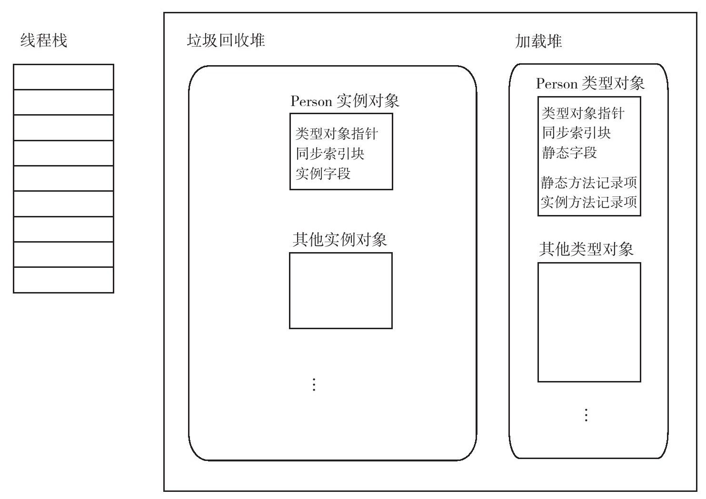
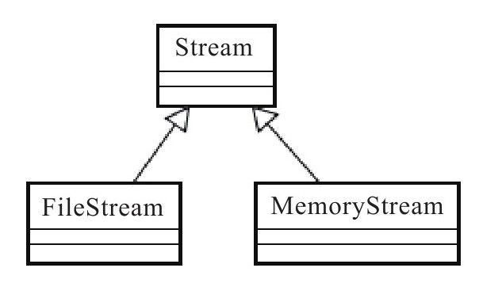
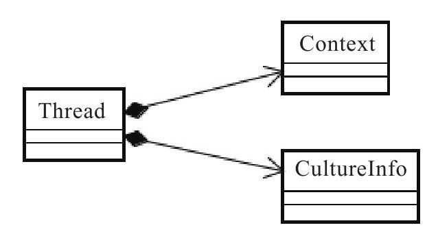

# 第二部分-架构篇

## 第7章 成员设计

### 建议90：不要为抽象类提供公开的构造方法

抽象类设计的本意只能让子类继承，而不是用于生成实例对象的。如果抽象类是public或internal的，它对于其他类型来说就是可见的，而这是不必要的，也是多余的。换句话说，抽象类只需对子类可见就行了。

不太能够理解这个原因.

### 建议91: 可见字段应该重构为属性

字段和属性有本质的区别。\
这个本质的区别就是：属性是方法. 属性是方法. 属性是方法.

属性相比较于字段，具有如下优势:\

1. 可以为属性添加代码。正因为属性是方法，所以可以在方法内对设置或获取属性的过程进行更多精细化的控制。常见的如：可以为属性添加NameChanged事件支持等。单凭字段本身是完成不了这样的功能的。
2. 可以让属性支持线程安全。要让属性变成线程安全的，可以让类型自身去实现。而要让字段支持线程安全，就只能靠调用者本身来实现了。
3. 属性得到了VS编辑器的支持，还得到了实现自动属性这种功能。自动属性的特点在LINQ中得到了广泛应用，尤其是匿名类型中，它只能实现只读的自动属性，而不支持字段。
4. 从设计的角度，也就是面向对象的角度来看，公开的字段也应该使用属性。改变字段的状态，类型不会被通知到；而改变属性的值，类型支持则会被通知。

### 建议92: 谨慎将数组或集合作为属性

主要还是因为集合中的, 引用属性, 可以被任意的修改.

### 建议93：构造方法应初始化主要属性和字段

类型的属性应该在构造方法调用完毕之前完成初始化工作。如果字段没有在初始化器中设置初始值，那么它就应该在构造方法中初始化。

类型一旦被实例化，那么它应该被视为具有完整的行为和属性。就好比，一旦一只健康的猫来到这个世界上，那它就应该具备猫爪和猫尾巴，而不是在查看这只猫的尾巴时得到一个null。

简单来说:\
就是字段应该在构造函数完成之前, 就应该有一个默认值的存在, 而不是返回一个null的存在, 避免其他地方在用到的时候混淆\
其他在这个时候, 就特别喜欢dotnet6的 可null 引用类型的设置, 能减少大量的判断null的无效操作.

### 建议94: 区别对待override和new

- 如果子类中的方法前面带有new关键字，则该方法被定义为独立于基类的方法。
- 如果子类中的方法前面带有override关键字，则子类的对象将调用该方法，而不是调用基类方法。

个人理解, new关键字就是覆盖, override关键字就是重写.\
使用new, 把子类转化成父类的时候, 调用的是父类的方法, 而不是子类的.\
其实使用new的情况似乎挺少的, SO?

### 建议95: 避免在构造方法中调用虚成员

```C#
class Person
{
    public Person()
    {
        InitSkin();
    }
    protected virtual void InitSkin()
    {
        //省略
    }
}
class American : Person
{
    Race Race;
    public American()
        : base()
    {
        Race = new Race() { Name = "White" };
    }
    protected override void InitSkin()
    {
        Console.WriteLine(Race.Name);
    }
}
```

太有趣的写法了. 不过如果我们使用了建议93, 可能会避免掉这样的错误.

### 建议96-建议98

- 成员应优先考虑公开基类型或接口\
让类型支持更多的应用场合
- 优先考虑将基类型或接口作为参数传递
- 用params减少重复参数

### (重要)建议99：重写时不应使用子类参数

```C#
class Employee
{
}
class Manager : Employee
{
}

class Salary
{
    public void SetSalary(Employee e)
    {
        Console.WriteLine("职员被设置了薪水。");
    }
}
class ManagerSalary : Salary
{
    public void SetSalary(Manager m)
    {
        Console.WriteLine("经理被设置了薪水。");
    }
}
```

这种写法是不会出现编译错误, 也不会出现警告

如果使用了子类参数，可能会偏离设计者的预期目标\
设计者的本意是要设置经理的薪水，可是实际调用的代码却设置了员工的薪水。\
在重写时使用子类参数有一定的风险，应当避免这种设计。正确的方法应当仍旧使用Employee类型参数，这起码能让编辑器提醒我们要使用new关键字.

### 建议100: 静态方法和实例方法没有区别

静态方法和实例方法有什么区别？首先我们应该坚决地、肯定地下一个结论：它们之间没有区别。


误解:

静态方法被不少人误解的地方还有：静态方法天然就是同步方法。即便是那些有一定开发经验的程序员，有的时候也会犯这种常识性的错误。尽管微软声称FCL中大部分代码都被实现成线程安全的了，但并不意味着代码天然就是同步的，要让静态方法线程安全，必须由程序员编写同步代码，而不是让编译器或运行时为我们做这些事情。

其实我不是很能理解..

### 建议101：使用扩展方法，向现有类型“添加”方法

其实现在这个不用多说些什么

## 第8章: 类型设计

### 建议102: 区分接口和抽象类的应用场合

区别:

1. 接口支持多继承，抽象类则不能。
2. 接口可以包含方法、属性、索引器、事件的签名，但不能有实现，抽象类则可以。
3. 接口在增加新方法后，所有的继承者都必须重构，否则编译不会通过，而抽象类则不需要。

应用场景:

1. 如果对象存在多个功能相近且关系紧密的版本，则使用抽象类。
2. 如果对象关系不紧密，但是若干功能拥有共同的声明，则使用接口。
3. 抽象类适合于提供丰富功能的场合，接口则更倾向于提供单一的一组功能。

接口案例: IEnumerable＜T＞  
抽象案例: stream(流) 文件流、内存流等。流在C#中可以表现为一个比特数组（byte），所以可以预见到在流的多个版本之间，会涉及一些针对byte[]数组的共性操作。

### 建议103: 区分组合和继承的应用场合

zrq: 没有看懂.

继承: 
组合: 

继承以上的优点，正好又是它的缺点。子类天然具有基类的公开接口，而这正好破坏了面向对象中的“封装性”。我们显然不需要每一层的类型都具备上层类的所有接口。一个类，如果其继承体系达到了3层（当然，凡事都有特例，WPF体系中的控件继承体系，以Shape为例，多达7层），就可以考虑停止了。如果不停止，对调用者来说，最底层的类型将会有多少公开的方法和属性呢？

答案是最底层的类型会拥有所有上层类型的开放接口。随着项目的发展，组合的优势会逐渐体现出来，它良好的封装性使类型可以对外宣称：我只做一件事情。

组合的另一个优势是，它可以组合多个其他类型。在Thread这个类中，它组合了上下文Context和区域信息CultureInfo。如果我们愿意，想组合多少个类型就可以组合多少个类型。不过，如果组合太多类型，就意味着当前的类很有可能做了太多的事情，它就需要被拆分为两个类了。继承不具有这种特性，在C#中，子类只能有一个基类（接口则放开这种限制，子类可以继承自多个接口）。

应当根据实际情况考虑是使用继承还是组合。一般来讲，组合更能满足大部分的应用场景。不要为了让代码看起来像“面向对象的”，而滥用继承。

### (重要)建议104: 用多态代替条件语句

zrq: 相当有趣的一个建议, 感觉好像工厂的一种设计方式.

如果我们有一个枚举, 不同的枚举判断去做不同的事情, 一般就喜欢做 if else 或者 switch 去做判断, 如果枚举不断的扩张, if else 也会越来越蛋疼. 如果我们尝试这样设计:

```C#
abstract class Commander
{
    public abstract void Execute();
}
class StartCommander : Commander
{

    public override void Execute()
    {
        //启动
    }
}
class StopCommander : Commander
{

    public override void Execute()
    {
        //停止
    }
}

static void Main(string[] args)
{
    Commander commander = new StartCommander();
    Drive(commander);
    commander = new StopCommander();
    Drive(commander);
}
static void Drive(Commander commander)
{
    commander.Execute();
}
```

### 建议105: 使用私有构造函数强化单例

单例的用法. 私有化构造, 多线程双锁

要强调的一点是：单例应该同时是一个sealed类型, 不可被继承

### (重要)建议106: 为静态类添加静态构造函数

静态类还有内置的静态函数

- 只被执行一次，且在第一次调用类成员之前被运行时执行.
- 代码无法调用它，不像实例构造方法使用new关键字就可以被执行.
- 没有访问标识符.
- 不能带任何参数.

使用静态构造方法的好处是，可以初始化静态成员并捕获在这过程中发生的异常。而使用静态成员初始化器则不能在类型内部捕获异常了.

对静态引用类型的初始化应该使用静态构造方法。但是，如果一个静态类只有值类型的变量，则可以放宽这种限制。

### 建议107: 区分静态类和单例

- 建议107: 区分静态类和单例
- 建议108: 将类型标识为sealed
- 建议109: 谨慎使用嵌套类
使用嵌套类的原则是：当某类型需要访问另一个类型的私有成员时，才将它实现为嵌套类.
- 建议110: 用类代替enum\
跟建议104很类式的做法
- 建议111: 避免双向耦合

## 安全性设计

直接跳过这个部分

### 建议113: 声明变量前考虑最大值

在C#中，如果要避免犯类似的错误，有一个补救措施，那就是为运算加上checked关键字。使用checked关键字作为一种补救措施，在运算溢出的时候会抛出一个异常，而不是让程序继续下去

举例游戏, 以前的老游戏, (修改一些数值)去买东西的话, 会买的越多, 钱越多.

### 建议118：使用SecureString保存密钥等机密字符串

SecureString 在被取出来的时候, 会直接从内存中销毁掉..

### 建议119：不要使用自己的加密算法

### 建议121：为应用程序设定运行权限